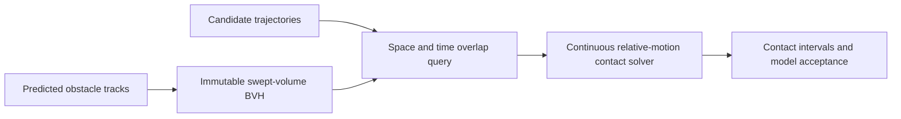

# motion-guard

[](https://github.com/yafi-s/motion-guard/actions/workflows/ci.yml)

**Continuous collision auditing for candidate motion trajectories, in C++20.**

A crossing can happen between two collision-free samples. Motion-guard solves
contact intervals for piecewise-linear moving discs, indexes obstacle segments in
a space/time BVH, and evaluates proposed trajectories against collisions, speed,
and a finite-difference acceleration proxy.

The recorded 10,000-obstacle experiment reduced narrow-phase checks from
**10,000,000 to 2,320**, returning the same **566 segment-pair contacts** as the
all-pairs reference. Geometry tests compare 100,000 randomized cases against an
independent closest-distance calculation.

Relevant to autonomy simulation, trajectory validation, and spatial indexing—the
engineering themes behind work at organizations such as Waymo. No affiliation or
use of proprietary data is implied. Built with AI assistance.

## Run

C++20 compiler, Make; no external dependencies.

```sh
make all test
./build/experiment --scenario
./build/experiment --audit examples/obstacles.csv examples/candidates.csv
./build/experiment
```

The scenario compares a straight crossing with a candidate that waits. The first
contacts the obstacle at about 1.646 seconds; the second passes the model's checks.
The CSV interface accepts `id,radius_m,time_s,x_m,y_m` rows. Each track must cover
the same complete horizon, starting at zero, with strictly increasing sample times.
Candidate rows may be grouped by ID; output is one JSON object per candidate.



## Design choices

| Problem | Mechanism |
| --- | --- |
| Collisions between samples | Quadratic contact intervals over overlapping segment times |
| Large obstacle sets | Swept spatial bounds plus time intervals in a median-split BVH |
| Touching broad-phase bounds | Outward-rounded bounds and inclusive comparisons |
| Nearly cancelling roots | Stable quadratic root formulation, extended arithmetic where available |
| Differing prediction timestamps | Interpolate each segment onto its common overlap interval |
| Reproducible reports | Sort by contact time, obstacle ID, and segment ordinals |

[Geometry and model contract](docs/DESIGN.md) · [Benchmarks](docs/BENCHMARKS.md)
· [Tests](tests/test.cpp) · [Review guide](docs/REVIEW.md)

## Model boundaries

This is an offline geometry and evaluation library, not a vehicle controller or a
safety certification system. Discs can conservatively bound fixed footprints, but
prediction error, tire dynamics, road rules, articulated bodies, and uncertain
agent behavior are outside the model. Piecewise-linear trajectories have velocity
jumps; the acceleration metric is a sampled proxy, not a physical acceleration
guarantee. Floating-point calculations are not formally verified predicates.

The corpus is synthetic. No performance on Waymo Open Dataset is claimed. Waymo's
[collision avoidance testing research](https://waymo.com/research/collision-avoidance-testing-of-the-waymo-automated/)
provides context for why scenario evaluation matters; this project does not
implement or reproduce that methodology.

MIT licensed. Companion mobility project: [fleet-match](https://github.com/yafi-s/fleet-match).
